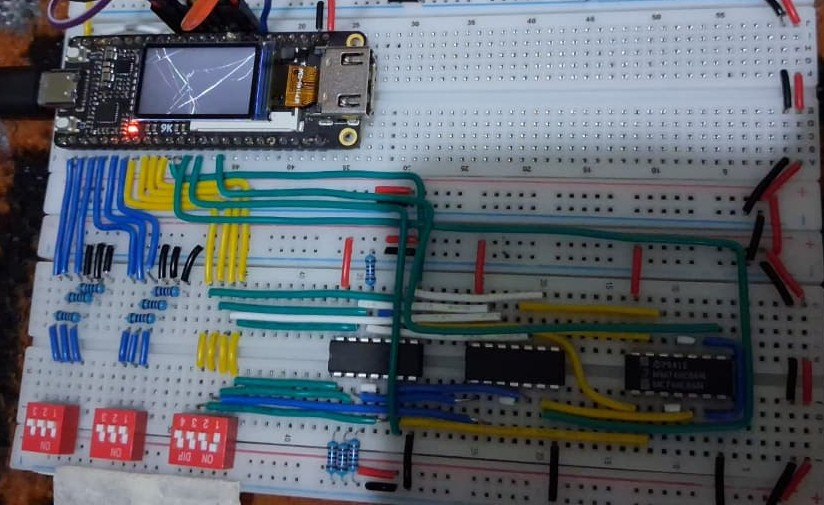
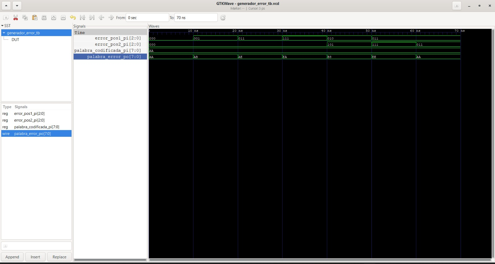
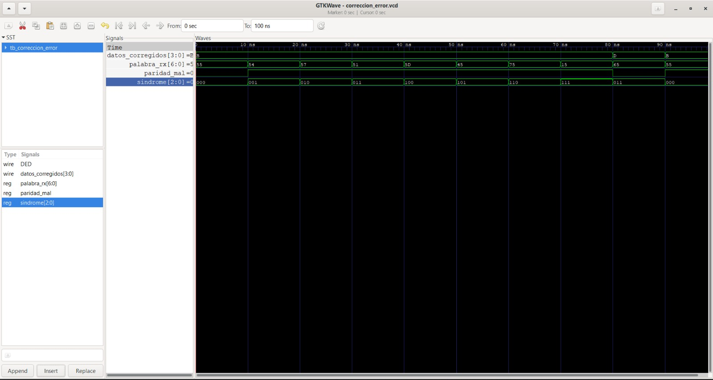
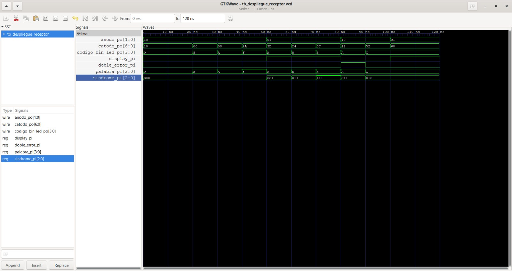
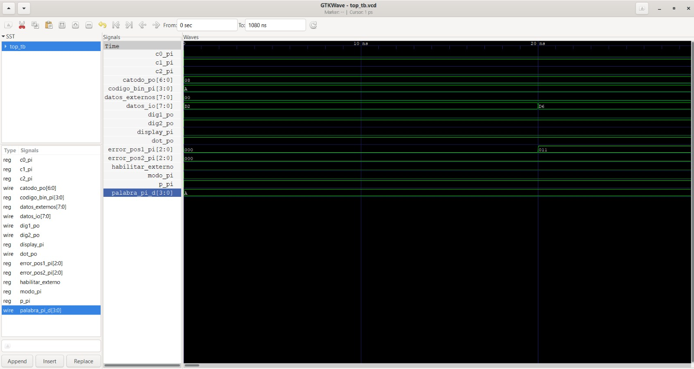
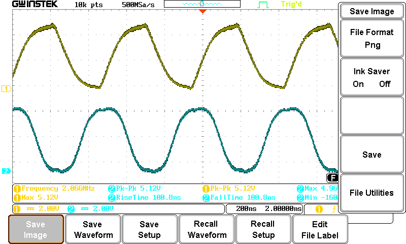
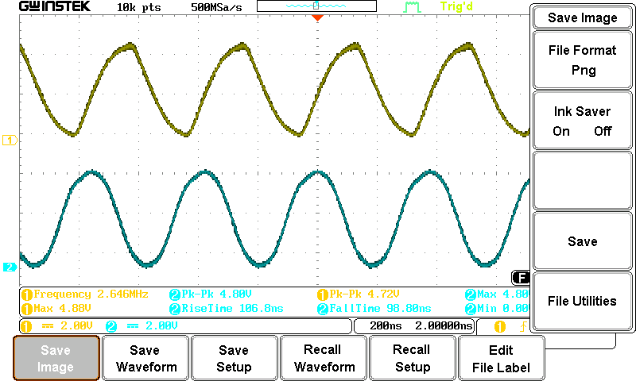
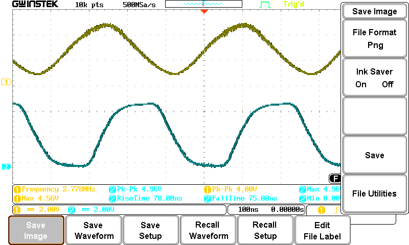
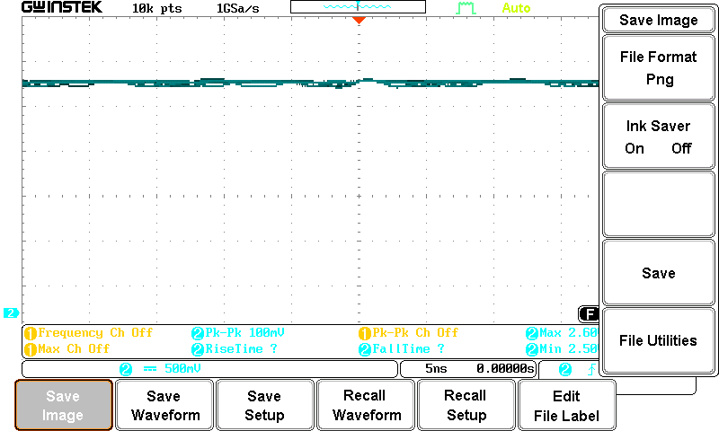

# Proyecto 1 - Diseño Lógico

## 1. Descripción general del proyecto

Este proyecto consiste en el diseño e implementación de un sistema para la transmisión, detección y corrección de errores en palabras binarias mediante el código de Hamming (7,4).

El sistema combina circuitos integrados de lógica combinacional CMOS con dispositivos FPGA. La implementación se divide principalmente en dos partes: un **transmisor** y un **receptor**, los cuales se comunican mediante una palabra de 8 bits.

El transmisor recibe una palabra de información de 4 bits, genera los bits de paridad correspondientes al código de Hamming (7,4) y añade un bit adicional de paridad para la detección de doble error (DED) mediante compuertas XOR alambradas; además, permite introducir uno o dos errores en la palabra antes de su transmisión con otra FPGA.

El receptor recibe la palabra de 8 bits y realiza la verificación de paridad, la determinación del síndrome de Hamming y la corrección de errores simples (SEC) o detección de errores dobles (DED). Finalmente, la palabra recibida o corregida se visualiza mediante LEDs y displays de 7 segmentos.

Además, como parte del proyecto se implementa y caracteriza experimentalmente un oscilador en anillo utilizando compuertas inversoras, con el objetivo de analizar el tiempo de propagación y el comportamiento temporal de las señales digitales.

---

## 2. Abreviaturas y definiciones

- **FPGA:** Field Programmable Gate Array.
- **HDL:** Hardware Description Language.
- **SEC:** Single Error Correction. Corrección de un error en una palabra transmitida.
- **DED:** Double Error Detection. Detección de dos errores en una palabra transmitida.
- **RTL:** Register Transfer Level. Nivel de descripción utilizado para representar el comportamiento del diseño antes de la síntesis.
- **CI:** Circuito Integrado.
- **Hamming (7,4):** Código de detección y corrección de errores que utiliza 4 bits de información y 3 bits de paridad.
- **Síndrome:** Palabra binaria generada a partir de la verificación de los bits de paridad de Hamming y utilizada para determinar la posición de un posible error.
- **Pull-down:** Resistencia utilizada para establecer un nivel lógico bajo definido cuando una entrada no está siendo activada.

---

## 3. Referencias

[1] D. Harris y S. Harris, *Digital Design and Computer Architecture: RISC-V Edition*. Morgan Kaufmann, 2022. ISBN: 978-0-12-820064-3.

[2] Escuela de Ingeniería Electrónica, EL-3307 Diseño Lógico, *Proyecto corto I: Diseño digital combinacional mixto*, II Semestre 2026.

---

## 4. Asignación de pines y conexiones

La siguiente tabla presenta la asignación de pines utilizada para las
entradas y salidas externas de la FPGA, así como las conexiones destinadas
a la comunicación entre la FPGA transmisora y la FPGA receptora.

### 4.1 Asignación general de pines

| Señal | Pin Tang Nano 9K | Función / Descripción |
|---|---:|---|
| `codigo_bin_pi[0]` | 30 | Entrada del bit 0 de la palabra de datos mediante DIP switch |
| `codigo_bin_pi[1]` | 29 | Entrada del bit 1 de la palabra de datos mediante DIP switch |
| `codigo_bin_pi[2]` | 28 | Entrada del bit 2 de la palabra de datos mediante DIP switch |
| `codigo_bin_pi[3]` | 27 | Entrada del bit 3 de la palabra de datos mediante DIP switch |
| `error_pos1_pi[0]` | 36 | Bit 0 del switch de selección de posición para la inserción del primer error |
| `error_pos1_pi[1]` | 37 | Bit 1 del switch de selección de posición para la inserción del primer error |
| `error_pos1_pi[2]` | 38 | Bit 2 del switch de selección de posición para la inserción del primer error |
| `error_pos2_pi[0]` | 26 | Bit 0 del switch de selección de posición para la inserción del segundo error |
| `error_pos2_pi[1]` | 25 | Bit 1 del switch de selección de posición para la inserción del segundo error |
| `error_pos2_pi[2]` | 39 | Bit 2 del switch de selección de posición para la inserción del segundo error |
| `c0_pi` | 40 | Entrada proveniente de la compuerta XOR correspondiente al bit de paridad `C0` |
| `c1_pi` | 33 | Entrada proveniente de la compuerta XOR correspondiente al bit de paridad `C1` |
| `c2_pi` | 34 | Entrada proveniente de la compuerta XOR correspondiente al bit de paridad `C2` |
| `p_pi` | 41 | Entrada de la compuerta XOR correspondiente al bit de paridad global `P` para DED |
| `modo_pi` | 69 | Switch de selección del modo de funcionamiento: transmisor o receptor |
| `display_pi` | 48 | Switch de selección de la información mostrada en los displays (palabra recibida o bit de error) |
| `dot_po` | 31 | Salida para el punto decimal del display, utilizada como indicador de doble error (DED) |
| `catodo_po[0]` | 76 | Control del segmento `E` del display de 7 segmentos |
| `catodo_po[1]` | 75 | Control del segmento `D` del display de 7 segmentos |
| `catodo_po[2]` | 72 | Control del segmento `A` del display de 7 segmentos |
| `catodo_po[3]` | 71 | Control del segmento `B` del display de 7 segmentos |
| `catodo_po[4]` | 70 | Control del segmento `C` del display de 7 segmentos |
| `catodo_po[5]` | 74 | Control del segmento `F` del display de 7 segmentos |
| `catodo_po[6]` | 73 | Control del segmento `G` del display de 7 segmentos |
| `dig1_po` | 63 | Control del ánodo del primer display mediante transistor PNP |
| `dig2_po` | 77 | Control del ánodo del segundo display mediante transistor PNP |

### 4.2 Comunicación FPGA ↔ FPGA

La comunicación entre la FPGA transmisora y la FPGA receptora se realiza
mediante un bus bidireccional de 8 bits.

La palabra transmitida se organiza según el orden visto en clase (para que no se pueda introducir un error en la paridad global):

```text
P  i3  i2  i1  C2  i0  C1  C0
```

---

## 5. Desarrollo

<details>
<summary><strong>5.1 Subsistema 1 — Transmisor</strong></summary>

<details>
<summary><strong>Módulo: Lectura y visualización de la palabra</strong></summary>

#### 1. Encabezado del módulo

El módulo `binario_7seg` es parte del transmisor. Su función es recibir una palabra binaria de 4 bits ingresada mediante los dip switches y generar las señales necesarias para visualizar la palabra ingresada en un display de 7 segmentos utilizando notación hexadecimal.

Este subsistema se implementa dentro de la FPGA y permite al usuario confirmar visualmente la palabra ingresada antes de que sea enviada al codificador Hamming (7,4).

##### Código del módulo

```SystemVerilog
module binario_7seg (
    input  wire [3:0] codigo_bin_pi,
    output wire [6:0] catodo_po
);

endmodule
```

#### 2. Parámetros
Este módulo no utiliza parámetros configurables.


#### 3. Entradas y salidas

| Señal | Tipo | Ancho | Función |
|:---|:---:|:---:|:---|
| `codigo_bin_pi` | Entrada | 4 bits | Palabra binaria ingresada por el usuario mediante los dip switches |
| `catodo_po` | Salida | 7 bits | Señales de control de los segmentos del display |

La correspondencia utilizada entre las salidas y los segmentos es:

| Salida | Segmento |
|:---|:---:|
| `catodo_po[6]` | G |
| `catodo_po[5]` | F |
| `catodo_po[4]` | C |
| `catodo_po[3]` | B |
| `catodo_po[2]` | A |
| `catodo_po[1]` | D |
| `catodo_po[0]` | E |

El display utilizado es de ánodo común, por lo que un `0` en el cátodo permite encender el segmento correspondiente.


#### 4. Criterios de diseño
El módulo recibe una palabra binaria de 4 bits y genera las señales correspondientes para mostrar su representación hexadecimal en el display de 7 segmentos.

La lógica de control de los segmentos se implementa mediante expresiones booleanas en SystemVerilog.

La visualización permite verificar directamente la palabra introducida mediante los conmutadores antes de continuar con el proceso de codificación Hamming.


#### 5. Testbench
##### 5.1 Objetivo del testbench

El testbench `tb_binario_7seg` se desarrolló para verificar mediante simulación RTL (pre-síntesis) el funcionamiento del módulo `binario_7seg`.

La prueba busca comprobar las 16 combinaciones posibles de la entrada de cuatro bits y observar la respuesta generada en `catodo_po[6:0]`.

Además, el testbench genera un archivo `.vcd` para visualizar las señales mediante GTKWave.

##### 5.2 Estructura del testbench

Los archivos utilizados son:

```text
src/
├── design/
│   └── binario_7seg.sv
└── sim/
    └── tb_binario_7seg.sv
```

El testbench contiene:

1. La señal de entrada controlada por el testbench.
2. La señal de salida observada.
3. La instancia del módulo bajo prueba (DUT).
4. La generación del archivo VCD.
5. Un bloque `initial` que aplica las diferentes entradas.
6. La finalización de la simulación mediante `$finish`.

##### 5.3 Señales del testbench

La entrada se declara como:

```SystemVerilog
reg [3:0] codigo_bin_pi;
```

Se utiliza `reg` porque el testbench asigna diferentes valores a esta señal durante la simulación.

La salida se declara como:

```SystemVerilog
wire [6:0] catodo_po;
```

Se utiliza `wire` porque la señal es generada por el módulo bajo prueba y el testbench solamente la observa.

La relación entre ambos elementos es:

```text
              TESTBENCH
                  │
                  │ codigo_bin_pi[3:0]
                  ▼
          ┌─────────────────┐
          │  binario_7seg   │
          │      DUT        │
          └────────┬────────┘
                   │
                   │ catodo_po[6:0]
                   ▼
              TESTBENCH
                   │
                   ▼
                GTKWave
```

##### 5.4 Instancia del DUT

El módulo se instancia dentro del testbench mediante:

```SystemVerilog
binario_7seg DUT (
    .codigo_bin_pi(codigo_bin_pi),
    .catodo_po(catodo_po)
);
```

##### 5.5 Generación del archivo VCD

Para almacenar las señales de la simulación y posteriormente observarlas en GTKWave se utilizan:

```SystemVerilog
$dumpfile("binario_7seg.vcd");
$dumpvars(0, tb_binario_7seg);
```

##### 5.6 Aplicación de las entradas

El testbench prueba las 16 combinaciones posibles de la entrada de 4 bits.

Cada combinación se mantiene durante 10 ns antes de aplicar la siguiente. Por lo tanto, la simulación completa tiene una duración aproximada de 160 ns.

Las entradas corresponden a los valores hexadecimales:

```text
0, 1, 2, 3, 4, 5, 6, 7,
8, 9, A, B, C, D, E, F
```

##### 5.7 Resultados de la simulación RTL

Los valores observados durante la simulación fueron:

| Entrada | `catodo_po` |
|:---:|:---:|
| 0 | `40` |
| 1 | `67` |
| 2 | `20` |
| 3 | `21` |
| 4 | `07` |
| 5 | `09` |
| 6 | `08` |
| 7 | `63` |
| 8 | `00` |
| 9 | `01` |
| A | `02` |
| B | `0C` |
| C | `18` |
| D | `20` |
| E | `18` |
| F | `1A` |

Estos valores corresponden a las señales de control de los siete segmentos según el mapeo definido para el display de ánodo común.

##### 5.8 Flujo de simulación

La simulación se ejecutó utilizando las herramientas del entorno de desarrollo del proyecto.

Desde la carpeta correspondiente a la simulación se utilizaron los comandos:

```text
make test
```

para ejecutar el testbench, y:

```text
make wv
```

para visualizar las señales generadas mediante GTKWave.

El archivo VCD generado permite observar la variación de `codigo_bin_pi` y la respuesta correspondiente de `catodo_po`.

##### 5.9 Resultado del testbench

La simulación RTL permitió comprobar el comportamiento del módulo para las 16 combinaciones posibles de la palabra de entrada.

Las señales observadas en GTKWave mostraron la relación esperada entre la entrada `codigo_bin_pi[3:0]` y la salida `catodo_po[6:0]`.

Por lo tanto, el testbench permitió verificar funcionalmente el módulo `binario_7seg` antes de continuar con las siguientes etapas del transmisor.

</details>

<details>
<summary><strong>Módulo: Codificación Hamming (7,4)</strong></summary>

#### 1. Encabezado del módulo
El módulo de codificación Hamming (7,4) recibe una palabra de información de 4 bits de los dip switch y genera una palabra codificada de 7 bits, incorporando tres bits de paridad.

La lógica de paridad se realizó mediante compuertas XOR físicas, mientras que la palabra de información es proporcionada por la FPGA.

```text
Entrada:
i3 i2 i1 i0

Salida:
i3 i2 i1 C2 i0 C1 C0
```

#### 2. Parámetros
Este módulo no utiliza parámetros configurables.

#### 3. Entradas y salidas
| Señal | Tipo | Ancho | Función |
|:---|:---:|:---:|:---|
| `codigo_bin_pi` | Entrada | 4 bits | Palabra de información ingresada mediante los conmutadores de la FPGA |
| `c0_pi` | Entrada | 1 bit | Bit de paridad C0 generado mediante lógica XOR |
| `c1_pi` | Entrada | 1 bit | Bit de paridad C1 generado mediante lógica XOR |
| `c2_pi` | Entrada | 1 bit | Bit de paridad C2 generado mediante lógica XOR |
| `palabra_codificada` | Salida | 7 bits | Palabra Hamming formada por los cuatro bits de información y los tres bits de paridad |

La palabra codificada utiliza el siguiente orden:

```text
i3 i2 i1 C2 i0 C1 C0
```

La correspondencia entre las posiciones Hamming y los bits es:

| Posición Hamming | Bit |
|:---:|:---:|
| 1 | C0 |
| 2 | C1 |
| 3 | i0 |
| 4 | C2 |
| 5 | i1 |
| 6 | i2 |
| 7 | i3 |

#### 4. Criterios de diseño
Los tres bits de paridad del código Hamming (7,4) se obtienen mediante operaciones XOR realizadas con compuertas lógicas físicas.

La FPGA proporciona los cuatro bits de información y recibe los bits de paridad generados externamente para formar la palabra codificada.

La distribución de los bits sigue la estructura establecida para el código Hamming (7,4), colocando los bits de paridad en las posiciones 1, 2 y 4.

La implementación fue verificada experimentalmente mediante diferentes combinaciones de la palabra de entrada.

##### Evidencia experimental



*Figura. Implementación física de la codificación Hamming (7,4) mediante compuertas XOR y FPGA.*


#### 5. Testbench
No se implementó un testbench HDL para este módulo, debido a que la generación de los bits de paridad se realizó mediante compuertas XOR físicas.

La verificación del funcionamiento se realizó experimentalmente mediante el montaje físico y la observación de las señales generadas para diferentes palabras de entrada, utilizando un top_temporal.sv que mostrara en el display de 7 segmentos en vez de los 4 datos, los valores C0, C1, C2 y la paridad global del módulo de inserción de paridad DED. 


</details>


<details>
<summary><strong>Módulo: Inserción de paridad para DED</strong></summary>

#### 1. Encabezado del módulo
El módulo de inserción de paridad para DED incorpora un bit de paridad global `P` a la palabra Hamming de 7 bits.

La paridad global se obtiene mediante compuertas XOR físicas y permite complementar el código Hamming para diferenciar entre condiciones de un error y dos errores en el receptor.

La palabra transmitida queda formada por 8 bits:

```text
P i3 i2 i1 C2 i0 C1 C0
```

#### 2. Parámetros
Este módulo no utiliza parámetros configurables.

#### 3. Entradas y salidas
| Señal | Tipo | Ancho | Función |
|:---|:---:|:---:|:---|
| `palabra_codificada` | Entrada | 7 bits | Palabra Hamming formada por los bits de información y paridad |
| `p_pi` | Entrada | 1 bit | Bit de paridad global generado mediante lógica XOR |
| `palabra_transmitida` | Salida | 8 bits | Palabra Hamming con el bit de paridad global para DED |

El orden de transmisión utilizado es:

```text
P i3 i2 i1 C2 i0 C1 C0
```

El bit `P` corresponde a la paridad global de los siete bits del código Hamming.

#### 4. Criterios de diseño
El bit de paridad global se obtiene mediante una combinación de compuertas XOR aplicada a los siete bits de la palabra Hamming.

Este bit permite complementar la detección de errores del código Hamming y diferenciar las condiciones de error requeridas por el esquema SEC/DED.

La generación de la paridad se implementó mediante lógica combinacional física y posteriormente se integró con la palabra Hamming para formar la palabra de 8 bits que se comunica entre las FPGA.

##### Evidencia experimental


*Figura. Implementación física de la generación de paridad global para DED.*

#### 5. Testbench
No se implementó un testbench HDL para este módulo, debido a que la generación de la paridad global se realizó mediante compuertas XOR físicas.

La verificación se realizó experimentalmente mediante el montaje físico y la medición de las señales obtenidas para diferentes palabras Hamming, utilizando un top_temporal.sv que mostrara en el display de 7 segmentos en vez de los 4 datos, los valores C0, C1, C2 y la paridad global del módulo de inserción de paridad DED. 

</details>


<details>
<summary><strong>Módulo: Generador de error</strong></summary>

#### 1. Encabezado del módulo
El módulo `generador_error` es parte del transmisor y tiene como función introducir uno o dos errores en la palabra codificada mediante Hamming (7,4).

La posición de cada error se selecciona mediante dos entradas de 3 bits. Cada entrada permite seleccionar una de las siete posiciones correspondientes a los bits del código Hamming. El valor `000` indica que no se introduce error.

El bit de paridad global `P` no se modifica, ya que corresponde a la paridad utilizada para la detección de doble error (DED).

```SystemVerilog
module generador_error (
    input wire [7:0] palabra_codificada_pi,
    input wire [2:0] error_pos1_pi,
    input wire [2:0] error_pos2_pi,
    output wire [7:0] palabra_error_po
);
```

#### 2. Parámetros
Este módulo no utiliza parámetros configurables.


#### 3. Entradas y salidas
| Señal | Tipo | Ancho | Función |
|:---|:---:|:---:|:---|
| `palabra_codificada_pi` | Entrada | 8 bits | Palabra codificada mediante Hamming (7,4) con el bit de paridad global |
| `error_pos1_pi` | Entrada | 3 bits | Selecciona la posición del primer error |
| `error_pos2_pi` | Entrada | 3 bits | Selecciona la posición del segundo error |
| `palabra_error_po` | Salida | 8 bits | Palabra codificada con los errores seleccionados |

Las posiciones seleccionables mediante `error_pos1_pi` y `error_pos2_pi` son:

| Entrada | Posición |
|:---:|:---:|
| `000` | Sin error |
| `001` | Posición 1 |
| `010` | Posición 2 |
| `011` | Posición 3 |
| `100` | Posición 4 |
| `101` | Posición 5 |
| `110` | Posición 6 |
| `111` | Posición 7 |

Las posiciones 1 a 7 corresponden exclusivamente a los siete bits del código Hamming. El bit `P`, correspondiente al bit de paridad global, permanece sin modificaciones.


#### 4. Criterios de diseño
El módulo utiliza dos entradas de 3 bits para seleccionar independientemente las posiciones donde se introducirán los errores.

Cada entrada se decodifica mediante expresiones booleanas para generar una señal asociada a cada una de las siete posiciones posibles.

La inserción del error se realiza mediante operaciones XOR. Cuando la señal de error correspondiente es `0`, el bit original se conserva; cuando es `1`, el bit se invierte.

La palabra de salida mantiene el mismo orden de bits de la palabra de entrada. Los siete bits correspondientes al código Hamming pueden ser modificados, mientras que el bit de paridad global `P` se conserva directamente:

```text
palabra_error_po[7] = palabra_codificada_pi[7]
```

De esta manera, el generador permite introducir hasta dos errores en las posiciones seleccionadas del código Hamming sin modificar la paridad global.


#### 5. Testbench
El testbench `tb_generador_error` se desarrolló para verificar la correcta inserción de uno o dos errores en las posiciones seleccionadas del código Hamming.

Se utilizaron diferentes combinaciones de las entradas `error_pos1_pi` y `error_pos2_pi`, manteniendo como palabra de entrada `10101010`. Se probaron los casos sin error, un error en diferentes posiciones, dos errores en posiciones diferentes y el caso en que ambas posiciones de error son iguales.

##### Resultados de la simulación

| Prueba | `Error 1` | `Error 2` | Entrada | Salida | Resultado |
|:---|:---:|:---:|:---:|:---:|:---|
| Sin errores | `000` | `000` | `10101010` | `10101010` | Correcto |
| Error en posición 1 | `001` | `000` | `10101010` | `10101011` | Correcto |
| Error en posición 3 | `011` | `000` | `10101010` | `10101110` | Correcto |
| Error en posición 7 | `111` | `000` | `10101010` | `11101010` | Correcto |
| Errores en posiciones 2 y 5 | `010` | `101` | `10101010` | `10111000` | Correcto |
| Errores en posiciones 3 y 7 | `011` | `111` | `10101010` | `11101110` | Correcto |
| Ambos errores en posición 3 | `011` | `011` | `10101010` | `10101010` | Correcto |

Las formas de onda obtenidas en GTKWave permitieron observar la correspondencia entre las posiciones seleccionadas mediante `error_pos1_pi` y `error_pos2_pi` y las señales internas de selección de error.



*Figura. Simulación RTL del testbench del generador de error.*

##### Resultado del testbench

Las pruebas realizadas verificaron que el módulo modifica únicamente las posiciones Hamming seleccionadas mediante las entradas de posición.

Cuando ambas posiciones seleccionadas son iguales, los dos cambios se cancelan debido a la operación XOR, por lo que la palabra de salida permanece igual a la palabra de entrada.

Por lo tanto, el testbench permitió verificar correctamente la inserción de cero, uno y dos errores en la palabra codificada.
</details>

</details>


<details>
<summary><strong>5.2 Subsistema 2 — Receptor</strong></summary>

<details>
<summary><strong>Módulo: Verificación de paridad</strong></summary>

#### 1. Encabezado del módulo
```SystemVerilog
module verificador_paridad (
    input  wire [7:0] palabra_pi,
    output wire       error_paridad_po
);
```

#### 2. Parámetros
Este módulo no utiliza parámetros configurables.

#### 3. Entradas y salidas
| Señal | Tipo | Ancho | Función |
|:---|:---:|:---:|:---|
| `palabra_pi` | Entrada | 8 bits | Palabra recibida, incluyendo los siete bits Hamming y el bit de paridad global |
| `error_paridad_po` | Salida | 1 bit | Indica el resultado de la verificación de paridad |

#### 4. Criterios de diseño
El módulo verifica la paridad de los ocho bits de la palabra recibida mediante una operación XOR entre todos sus bits.

La salida `error_paridad_po` permite determinar si la paridad de la palabra recibida es correcta o si existe una condición de paridad impar.

Esta señal se utiliza posteriormente junto con el síndrome Hamming para determinar si existe un error corregible o una condición de doble error.

#### 5. Testbench
El testbench `tb_verificador_paridad` se desarrolló para comprobar el funcionamiento del detector de paridad sobre palabras de 8 bits.

Se probaron diferentes palabras de entrada, incluyendo palabras con una cantidad par e impar de bits en estado lógico `1`. Para cada caso se verificó que la salida `error_paridad_po` indicara correctamente la condición de paridad.

##### Resultados de la simulación

| Prueba | Entrada `palabra_pi` | `error_paridad_po` | Resultado |
|:---:|:---:|:---:|:---|
| 1 | `00000000` | `0` | PASS |
| 2 | `00000001` | `1` | PASS |
| 3 | `00000011` | `0` | PASS |
| 4 | `10101010` | `0` | PASS |
| 5 | `00000111` | `1` | PASS |
| 6 | `11111111` | `0` | PASS |

Los resultados muestran que el módulo identifica correctamente las palabras con paridad par e impar.


*Figura. Simulación RTL del testbench del verificador de paridad.*

##### Resultado del testbench

Todas las pruebas realizadas fueron aprobadas. La salida `error_paridad_po` respondió correctamente para las diferentes combinaciones de entrada, verificando el funcionamiento de la comprobación de paridad de los ocho bits de la palabra recibida.

</details>


<details>
<summary><strong>Módulo: Determinación del síndrome Hamming</strong></summary>

#### 1. Encabezado del módulo
```SystemVerilog
module sindrome_hamming (
    input  wire [6:0] palabra_pi,
    output wire [2:0] sindrome_po
);
```

#### 2. Parámetros
Este módulo no utiliza parámetros configurables.

#### 3. Entradas y salidas
| Señal | Tipo | Ancho | Función |
|:---|:---:|:---:|:---|
| `palabra_pi` | Entrada | 7 bits | Siete bits recibidos correspondientes al código Hamming |
| `sindrome_po` | Salida | 3 bits | Indica la posición del posible error dentro de la palabra Hamming |

La entrada corresponde únicamente a los siete bits del código Hamming:

```text
i3 i2 i1 C2 i0 C1 C0
```

El bit de paridad global `P` no se utiliza para calcular el síndrome.

#### 4. Criterios de diseño
El síndrome Hamming se obtiene mediante tres operaciones XOR independientes.

Cada bit del síndrome verifica un conjunto específico de posiciones del código Hamming:

| Bit del síndrome | Posiciones verificadas |
|:---:|:---|
| `sindrome_po[0]` | C0, i0, i1, i3 |
| `sindrome_po[1]` | C1, i0, i2, i3 |
| `sindrome_po[2]` | C2, i1, i2, i3 |

El valor obtenido en el síndrome representa, en binario, la posición del posible error dentro de las siete posiciones del código Hamming.

Un síndrome `000` indica que no se detecta un error en los siete bits Hamming.

Los valores `001` a `111` corresponden a las posiciones Hamming 1 a 7, respectivamente.


#### 5. Testbench
El testbench `tb_sindrome_hamming` se desarrolló para verificar que el módulo determine correctamente la posición de un posible error dentro de los siete bits del código Hamming (7,4).

Se realizaron pruebas sin error y con un error individual en cada una de las siete posiciones posibles. Además, se incluyó una prueba con una palabra general para comprobar el comportamiento del módulo.

##### Resultados de la simulación

| Prueba | Entrada `palabra_pi` | Síndrome esperado | Síndrome obtenido | Resultado |
|:---|:---:|:---:|:---:|:---|
| Sin error | `0000000` | `000` | `000` | Correcto |
| Error en bit 1 | `0000001` | `001` | `001` | Correcto |
| Error en bit 2 | `0000010` | `010` | `010` | Correcto |
| Error en bit 3 | `0000100` | `011` | `011` | Correcto |
| Error en bit 4 | `0001000` | `100` | `100` | Correcto |
| Error en bit 5 | `0010000` | `101` | `101` | Correcto |
| Error en bit 6 | `0100000` | `110` | `110` | Correcto |
| Error en bit 7 | `1000000` | `111` | `111` | Correcto |
| Caso general | `1010101` | `000` | `000` | Correcto |

Las formas de onda de GTKWave muestran que el síndrome cambia de acuerdo con la posición del bit que presenta el error.


*Figura. Simulación RTL del testbench del determinador de síndrome Hamming.*

##### Resultado del testbench

Las pruebas verificaron las siete posiciones posibles de error del código Hamming. En cada caso, el síndrome obtenido correspondió correctamente con la posición del bit alterado.

La prueba sin error y el caso general también produjeron un síndrome `000`, por lo que el módulo presentó el comportamiento esperado para las entradas evaluadas.

</details>


<details>
<summary><strong>Módulo: Corrección de error</strong></summary>

#### 1. Encabezado del módulo
```SystemVerilog
module correccion_error (
    input  wire [6:0] palabra_rx,
    input  wire       paridad_mal,
    input  wire [2:0] sindrome,
    output wire [3:0] datos_corregidos,
    output wire       DED
);
```

#### 2. Parámetros
Este módulo no utiliza parámetros configurables.

#### 3. Entradas y salidas
| Señal | Tipo | Ancho | Función |
|:---|:---:|:---:|:---|
| `palabra_rx` | Entrada | 7 bits | Palabra Hamming recibida, sin incluir la paridad global |
| `paridad_mal` | Entrada | 1 bit | Indica el resultado de la verificación de paridad global |
| `sindrome` | Entrada | 3 bits | Indica la posición del posible error |
| `datos_corregidos` | Salida | 4 bits | Palabra de información corregida |
| `DED` | Salida | 1 bit | Indica la detección de una condición de doble error |

#### 4. Criterios de diseño
El módulo utiliza conjuntamente el resultado de la verificación de paridad y el síndrome Hamming para determinar la condición de error de la palabra recibida.

Primero se determina si el síndrome es diferente de `000`. A partir de esta condición y del resultado de la verificación de paridad se identifican los casos de error.

Para un error simple corregible (SEC), se utiliza una paridad incorrecta junto con un síndrome diferente de `000`:

```text
paridad_mal = 1
sindrome ≠ 000
```

En esta condición, el síndrome indica la posición del bit que debe invertirse.

Para la detección de doble error (DED), se utiliza una paridad correcta junto con un síndrome diferente de `000`:

```text
paridad_mal = 0
sindrome ≠ 000
```

La corrección se realiza mediante operaciones XOR sobre los siete bits recibidos. Solamente se invierte el bit correspondiente a la posición indicada por el síndrome.

Finalmente, se extraen los cuatro bits de información de la palabra Hamming corregida:

```text
i3 i2 i1 i0
```

#### 5. Testbench
El testbench `tb_correccion_error` se desarrolló para verificar la corrección de errores simples y la detección de doble error mediante la combinación de la paridad global y el síndrome Hamming.

Se realizaron pruebas sin error, con un error individual en cada una de las siete posiciones Hamming, con dos errores y con un error únicamente en el bit de paridad global.

##### Resultados de la simulación

| Prueba | `Palabra RX` | `Paridad mal` | `Síndrome` | `Datos correg.` | `DED` |
|:---|:---:|:---:|:---:|:---:|:---:|
| Sin error | `1010101` | `0` | `000` | `1011` | `0` |
| Error en posición 1 | `1010100` | `1` | `001` | `1011` | `0` |
| Error en posición 2 | `1010111` | `1` | `010` | `1011` | `0` |
| Error en posición 3 | `1010001` | `1` | `011` | `1011` | `0` |
| Error en posición 4 | `1011101` | `1` | `100` | `1011` | `0` |
| Error en posición 5 | `1000101` | `1` | `101` | `1011` | `0` |
| Error en posición 6 | `1110101` | `1` | `110` | `1011` | `0` |
| Error en posición 7 | `0010101` | `1` | `111` | `1011` | `0` |
| Doble error | `1100101` | `0` | `011` | `1101` | `1` |
| Error en paridad global | `1010101` | `1` | `000` | `1011` | `0` |

Para las pruebas con un solo error, el síndrome indicó correctamente la posición afectada y los datos corregidos se recuperaron como `1011`.

En la prueba de doble error, la combinación de `paridad_mal = 0` y un síndrome diferente de `000` permitió activar la salida `DED`.

La prueba de error únicamente en la paridad global produjo un síndrome `000`, por lo que los cuatro bits de información permanecieron como `1011`.



*Figura. Simulación RTL del testbench del módulo de corrección de error.*

##### Resultado del testbench

El testbench verificó correctamente los casos de ausencia de error, error simple en cada una de las siete posiciones Hamming, doble error y error en la paridad global.

Para los errores simples, el módulo identificó la posición mediante el síndrome y recuperó correctamente la palabra de información `1011`.

En el caso de doble error, se activó la salida `DED`, indicando que la condición detectada no debía ser corregida como un error simple.

</details>


<details>
<summary><strong>Módulo: Despliegue de la palabra corregida</strong></summary>

#### 1. Encabezado del módulo
```SystemVerilog
module despliegue_receptor (
    input  wire [3:0] palabra_pi,
    input  wire [2:0] sindrome_pi,
    input  wire       doble_error_pi,
    input  wire       display_pi,
    output wire [3:0] codigo_bin_led_po,
    output wire [6:0] catodo_po,
    output wire [1:0] anodo_po
);
```

#### 2. Parámetros
Este módulo no utiliza parámetros configurables.

#### 3. Entradas y salidas
| Señal | Tipo | Ancho | Función |
|:---|:---:|:---:|:---|
| `palabra_pi` | Entrada | 4 bits | Palabra de información recibida o corregida |
| `sindrome_pi` | Entrada | 3 bits | Síndrome correspondiente a la posición del error |
| `doble_error_pi` | Entrada | 1 bit | Indica la detección de doble error |
| `display_pi` | Entrada | 1 bit | Selecciona si se muestra la palabra o el síndrome |
| `codigo_bin_led_po` | Salida | 4 bits | Control de los LEDs que representan la palabra |
| `catodo_po` | Salida | 7 bits | Control de los segmentos del display de 7 segmentos |
| `anodo_po` | Salida | 2 bits | Selección del display utilizado |

El selector `display_pi` funciona de la siguiente manera:

| `display_pi` | Información mostrada |
|:---:|:---|
| `0` | Palabra de 4 bits |
| `1` | Síndrome de 3 bits |

Cuando `doble_error_pi = 1`, el display muestra la letra hexadecimal `E` como indicación de doble error.


#### 4. Criterios de diseño
El módulo permite visualizar la información obtenida durante el proceso de recepción.

Los cuatro LEDs muestran siempre la palabra de información recibida mediante `codigo_bin_led_po`. El selector `display_pi` no modifica la información mostrada en los LEDs.

El display de 7 segmentos puede utilizarse para mostrar dos tipos de información:

- La palabra de 4 bits recibida o corregida.
- El síndrome Hamming correspondiente a la posición del error.

La selección se realiza mediante `display_pi`.

Cuando se detecta una condición de doble error, la entrada `doble_error_pi` tiene prioridad y el valor mostrado en el display corresponde a:

```text
1110 = E
```

La lógica de los siete segmentos se implementa mediante expresiones booleanas. Debido al uso de un display de ánodo común, las señales de los segmentos se invierten para generar las señales de control correspondientes.

La selección de los dos displays se realiza mediante las señales `anodo_po`.

#### 5. Testbench
El testbench `tb_despliegue_receptor` se desarrolló para verificar las diferentes funciones de visualización del receptor.

Se comprobaron la visualización de palabras de 4 bits en hexadecimal, la visualización del síndrome Hamming, la indicación de doble error y el funcionamiento independiente de los LEDs respecto al selector `display_pi`.

##### Resultados de la simulación

| Prueba | Palabra | Síndrome | DED | Display | LEDs | Cátodos | Ánodos |
|:---|:---:|:---:|:---:|:---:|:---:|:---:|:---:|
| Palabra 0 | `0000` | `000` | `0` | `0` | `0000` | `0010000` | `10` |
| Palabra 5 | `0101` | `000` | `0` | `0` | `0101` | `0000110` | `10` |
| Palabra A | `1010` | `000` | `0` | `0` | `1010` | `0001000` | `10` |
| Palabra F | `1111` | `000` | `0` | `0` | `1111` | `1001010` | `10` |
| Síndrome 1 | `1010` | `001` | `0` | `1` | `1010` | `0111101` | `01` |
| Síndrome 3 | `0101` | `011` | `0` | `1` | `0101` | `0100100` | `01` |
| Síndrome 7 | `0011` | `111` | `0` | `1` | `0011` | `0111100` | `01` |
| Doble error | `1010` | `011` | `1` | `0` | `1010` | `1000010` | `10` |

Además, se verificó que los LEDs mostraran la palabra de entrada independientemente del valor de `display_pi`:

| Palabra | `display_pi` | LEDs |
|:---:|:---:|:---:|
| `1100` | `0` | `1100` |
| `1100` | `1` | `1100` |

Las formas de onda obtenidas mediante GTKWave permitieron observar los cambios en `palabra_pi`, `sindrome_pi`, `doble_error_pi` y `display_pi`, así como las respuestas correspondientes en los LEDs, cátodos y ánodos.



*Figura. Simulación RTL del testbench del módulo de despliegue del receptor.*

##### Resultado del testbench

Las pruebas permitieron verificar las diferentes funciones de visualización del receptor.

Se comprobó la representación de palabras en hexadecimal, la visualización del síndrome seleccionado, la indicación de doble error y el funcionamiento independiente de los cuatro LEDs respecto al selector `display_pi`.

</details>

</details>


<details>
<summary><strong>Testbench del sistema completo (TOP)</strong></summary>

#### 1. Objetivo del testbench

El testbench `top_tb` permite verificar la integración de los módulos que conforman el sistema completo de transmisión y recepción.

Se realizan pruebas en los modos transmisor y receptor, verificando la generación de la palabra Hamming, la inserción de errores, la transmisión mediante el bus de 8 bits, la detección de errores, la corrección de un error simple y la detección de doble error.

Además, se verifica el funcionamiento del despliegue de la palabra corregida y del síndrome en el display de 7 segmentos.

#### 2. Pruebas del transmisor

##### Prueba 1 — Transmisor sin error

Se ingresó la palabra de información:

```text
Código de entrada: 1010
```

El transmisor generó la siguiente palabra en el bus:

```text
Datos en el bus: 11010010
Esperado:        11010010
```

La palabra generada coincide con el valor esperado.

**Resultado: Correcto.**

##### Prueba 2 — Transmisor con error en posición 3

Se utilizó como palabra original:

```text
11010010
```

Se configuró la inserción de un error en la posición Hamming 3:

```text
Posición Hamming: 3
Índice del vector: 2
```

La palabra obtenida después de la inserción del error fue:

```text
Palabra original:  11010010
Palabra con error: 11010110
Esperado:          11010110
```

Posteriormente, la palabra fue procesada por el receptor y se obtuvo:

```text
Palabra corregida: 1010
Esperado:          1010
```

El error fue insertado en la posición Hamming indicada y posteriormente corregido correctamente por el receptor.

**Resultado: Correcto.**

#### 3. Pruebas del receptor

##### Prueba 3 — Receptor sin error

Se ingresó al receptor la palabra:

```text
Datos recibidos: 11010010
```

El sistema obtuvo:

```text
Palabra recibida: 1010
Paridad mal:      0
Síndrome:         000
DED:              0
```

Los valores esperados fueron:

```text
Palabra esperada:  1010
Síndrome esperado: 000
DED esperado:      0
```

Los resultados obtenidos coinciden con los valores esperados.

**Resultado: Correcto.**

##### Prueba 4 — Receptor con un error

Se ingresó al receptor la palabra:

```text
11010110
```

Esta palabra contiene un error en la posición Hamming 3.

El receptor obtuvo:

```text
Palabra recibida: 1011
Paridad mal:      1
Síndrome:         011
Datos corregidos: 1010
DED:              0
```

Los valores esperados fueron:

```text
Síndrome esperado: 011
DED esperado:      0
```

El síndrome `011` identifica la posición Hamming 3. El módulo de corrección invierte el bit correspondiente y recupera la palabra original:

```text
Datos corregidos: 1010
```

En esta prueba también se cambió la selección del display para mostrar el síndrome.

**Resultado: Correcto.**

##### Prueba 5 — Receptor con dos errores

Se ingresó al receptor la palabra:

```text
11000110
```

El sistema obtuvo:

```text
Paridad mal: 0
Síndrome:    110
DED:         1
DOT:         0
```

Los valores esperados fueron:

```text
Síndrome esperado: 110
DED esperado:      1
```

El sistema identificó la condición de doble error mediante la combinación de la paridad global y el síndrome Hamming.

Debido a que `DED = 1`, el indicador `DOT` se activa mediante una salida en nivel bajo, debido a que el display utilizado es de ánodo común.

**Resultado: Correcto.**

#### 4. Despliegue de la palabra corregida

En el módulo `top` se utiliza la salida `datos_corregidos` del módulo de corrección como entrada del módulo `despliegue_receptor`.

Por lo tanto, cuando el sistema se encuentra en modo receptor y `display_pi = 0`, el display de 7 segmentos muestra la **palabra de información corregida**.

Cuando `display_pi = 1`, el display muestra el **síndrome Hamming**, permitiendo visualizar la posición del error detectado.

La selección se realiza mediante:

```text
display_pi = 0 → Palabra corregida
display_pi = 1 → Síndrome
```

#### 5. Evidencia de la simulación

La simulación del `top` fue realizada mediante GTKWave a partir del archivo `top_tb.vcd`.

En las formas de onda se pueden observar las señales correspondientes a los modos de transmisión y recepción, la palabra de entrada, las posiciones de error, el bus `datos_io[7:0]`, las señales de paridad y las salidas asociadas al display.



*Figura. Simulación del TOP durante las pruebas de transmisión.*


*Figura. Simulación del TOP durante las pruebas de recepción.*

#### 6. Resumen de resultados

| Prueba | Modo | Condición | Resultado |
|:---:|:---|:---|:---:|
| 1 | Transmisor | Sin error | Correcto |
| 2 | Transmisor + receptor | Error en posición 3 y corrección | Correcto |
| 3 | Receptor | Sin error | Correcto |
| 4 | Receptor | Un error en posición 3 | Correcto |
| 5 | Receptor | Dos errores | Correcto |

#### 7. Resultado del testbench

Las pruebas realizadas permitieron verificar la integración del transmisor y receptor dentro del módulo `top`.

Se comprobó la generación de la palabra codificada, la inserción de un error en una posición Hamming determinada, la transmisión de la palabra mediante el bus de 8 bits, la detección del error mediante la paridad y el síndrome, la corrección de un error simple y la detección de una condición de doble error.

También se verificó el funcionamiento del despliegue de la palabra corregida y del síndrome en el display de 7 segmentos.

Los resultados obtenidos en las cinco pruebas coincidieron con los valores esperados.

</details>


<details>
<summary><strong>5.3 Ejercicio 2 — Oscilador en anillo</strong></summary>

El objetivo de este ejercicio es caracterizar experimentalmente los parámetros
de temporización de las compuertas lógicas, principalmente el tiempo de retardo
de propagación $t_{PD}$ y los tiempos de subida y caída de la señal,
$t_{rise}$ y $t_{fall}$.

Para esto se construyó un oscilador en anillo utilizando inversores de un
74HC04. El período de oscilación permite relacionar la frecuencia del anillo
con el tiempo de propagación promedio de cada inversor.

El procedimiento experimental se dividió en cuatro configuraciones:

1. Oscilador con cinco inversores.
2. Oscilador con tres inversores.
3. Oscilador con tres inversores y aproximadamente 1 m de cable.
4. Un solo inversor con entrada y salida conectadas.

---

<details>
<summary><strong>5.3.1 Oscilador con cinco inversores</strong></summary>

### Montaje

Se construyó un oscilador en anillo utilizando cinco inversores del 74HC04.
Las cinco compuertas fueron conectadas en cascada y la salida del último
inversor se realimentó hacia la entrada del primero.

Para esta configuración:

```text
N = 5 inversores
```

La señal se observó mediante el osciloscopio, utilizando dos canales para
observar simultáneamente la entrada y salida de una de las etapas.

### Forma de onda experimental



### Resultados experimentales

A partir de la medición guardada directamente desde el osciloscopio se
obtuvieron los siguientes valores:

| Parámetro | Resultado |
|---|---:|
| Frecuencia | 2.666 MHz |
| Período | 375.1 ns |
| Vmax | 5.12 V |
| Vpp | 5.12 V |
| trise | 100.8 ns |
| tfall | 100.8 ns |

### Cálculo del período

El período se obtiene a partir de la frecuencia medida:

```math
T = \frac{1}{f}
```

Sustituyendo la frecuencia experimental:

```math
T = \frac{1}{2.666 \times 10^6}
```

Por lo tanto:

```math
\boxed{T \approx 375.1\ \text{ns}}
```

### Cálculo del tiempo de propagación

Para un oscilador en anillo compuesto por N inversores, el período está
relacionado con el tiempo de propagación promedio mediante:

```math
T = 2Nt_{PD}
```

Despejando el tiempo de propagación:

```math
t_{PD} = \frac{T}{2N}
```

Para cinco inversores:

```math
t_{PD} = \frac{375.1\ \text{ns}}{2(5)}
```

Por lo tanto:

```math
\boxed{t_{PD} \approx 37.5\ \text{ns}}
```

### Análisis

La configuración de cinco inversores produjo una señal periódica estable,
con una frecuencia aproximada de 2.666 MHz y un período de 375.1 ns.

A partir de estos valores se obtuvo un tiempo de propagación promedio de
aproximadamente 37.5 ns por inversor.

Los tiempos de subida y caída obtenidos fueron prácticamente iguales:

```math
t_{rise} \approx 100.8\ \text{ns}
```

```math
t_{fall} \approx 100.8\ \text{ns}
```

Por lo tanto, para esta configuración no se observó una diferencia apreciable
entre el tiempo necesario para la transición de subida y el tiempo necesario
para la transición de caída.

El valor de tPD obtenido en esta etapa se utilizará posteriormente para
estimar el período teórico del oscilador cuando se reduzca el número de
inversores a tres.

</details>


<details>
<summary><strong>5.3.2 Oscilador con tres inversores</strong></summary>

### Montaje

Se modificó el circuito anterior para utilizar únicamente tres inversores,
manteniendo la realimentación necesaria para formar el oscilador en anillo.

Para esta configuración:

```text
N = 3 inversores
```

### Forma de onda experimental



### Resultados experimentales

| Parámetro | Resultado |
|---|---:|
| Frecuencia | 2.648 MHz |
| Período medido | 377.6 ns |
| trise | 105.8 ns |
| tfall | 98.8 ns |
| Vmax | ≈ 4.8 V |

### Cálculo del período esperado

Para calcular el período esperado con tres inversores se utiliza el tiempo
de propagación obtenido anteriormente:

```math
t_{PD} \approx 37.5\ \text{ns}
```

La relación para el oscilador en anillo es:

```math
T = 2Nt_{PD}
```

Para tres inversores:

```math
T_{teórico} = 2(3)(37.5\ \text{ns})
```

Por lo tanto:

```math
\boxed{T_{teórico} \approx 225.0\ \text{ns}}
```

La frecuencia teórica correspondiente es:

```math
f_{teórico} = \frac{1}{T_{teórico}}
```

```math
f_{teórico} = \frac{1}{225.0 \times 10^{-9}}
```

Por lo tanto:

```math
\boxed{f_{teórico} \approx 4.44\ \text{MHz}}
```

### Cálculo del período experimental

La frecuencia medida experimentalmente fue:

```math
f_{medido} = 2.648\ \text{MHz}
```

Por lo tanto:

```math
T_{medido} = \frac{1}{2.648 \times 10^6}
```

```math
\boxed{T_{medido} \approx 377.6\ \text{ns}}
```

### Comparación entre el resultado teórico y experimental

| Magnitud | Teórico | Experimental |
|---|---:|---:|
| Período | 225.0 ns | 377.6 ns |
| Frecuencia | 4.44 MHz | 2.648 MHz |

La diferencia porcentual entre los períodos es:

```math
\%\text{ diferencia} =
\frac{T_{medido}-T_{teórico}}{T_{teórico}}\times100
```

```math
\%\text{ diferencia} =
\frac{377.6-225.0}{225.0}\times100
```

```math
\boxed{\%\text{ diferencia}\approx67.8\%}
```

### Análisis

Al reducir el número de inversores de cinco a tres, el modelo ideal predice
una reducción del período de oscilación, ya que:

```math
T = 2Nt_{PD}
```

indica una dependencia directa entre el período y el número de etapas del
anillo.

Sin embargo, el resultado experimental no coincidió con esta predicción.

El modelo produjo un período esperado de aproximadamente 225.0 ns, mientras
que el osciloscopio registró aproximadamente 377.6 ns.

Por lo tanto, no se obtuvo experimentalmente el período esperado.

La diferencia puede estar relacionada con las condiciones reales del montaje.
El cálculo supone que el tiempo de propagación promedio obtenido para cinco
inversores puede utilizarse directamente como un valor constante para la
configuración de tres inversores.

En el circuito real existen además efectos asociados al alambrado, las
conexiones de la protoboard, la carga de las sondas del osciloscopio y las
condiciones eléctricas de las diferentes etapas.

Por esta razón, el resultado obtenido debe interpretarse como una diferencia
entre el comportamiento ideal utilizado para el cálculo y el comportamiento
real observado experimentalmente.

</details>


<details>
<summary><strong>5.3.3 Tres inversores con aproximadamente 1 m de cable</strong></summary>

### Montaje

A partir del oscilador de tres inversores se incorporó aproximadamente un
metro de cable en la trayectoria de realimentación del anillo.

La conexión de realimentación se realizó entre el pin 6 y el pin 1 del
74HC04 mediante el tramo adicional de cable.

La finalidad de esta modificación fue observar experimentalmente cómo una
mayor longitud de interconexión afecta las características temporales de
la señal.

### Forma de onda experimental



### Resultados experimentales

| Parámetro | Sin cable | Con 1 m de cable |
|---|---:|---:|
| Frecuencia | 2.648 MHz | 2.778 MHz |
| Período | 377.6 ns | 360.0 ns |
| trise | 105.8 ns | 78 ns |
| tfall | 98.8 ns | 75 ns |
| Vmax | ≈ 4.8 V | ≈ 4.96 V |

### Cálculo del período con el cable

La frecuencia medida con el cable fue:

```math
f_{cable} = 2.778\ \text{MHz}
```

Por lo tanto:

```math
T_{cable} = \frac{1}{2.778 \times 10^6}
```

```math
\boxed{T_{cable} \approx 360.0\ \text{ns}}
```

### Cambio en la frecuencia

El cambio porcentual de la frecuencia se calculó mediante:

```math
\%\Delta f =
\frac{f_{cable}-f_{sin\ cable}}{f_{sin\ cable}}\times100
```

```math
\%\Delta f =
\frac{2.778-2.648}{2.648}\times100
```

```math
\boxed{\%\Delta f \approx +4.9\%}
```

Por lo tanto, experimentalmente la frecuencia aumentó aproximadamente un
4.9 %.

### Cambio en el período

El cambio porcentual del período fue:

```math
\%\Delta T =
\frac{T_{cable}-T_{sin\ cable}}{T_{sin\ cable}}\times100
```

```math
\%\Delta T =
\frac{360.0-377.6}{377.6}\times100
```

```math
\boxed{\%\Delta T \approx -4.7\%}
```

Por lo tanto, el período disminuyó aproximadamente un 4.7 %.

### Análisis

La incorporación del metro adicional de cable produjo una modificación
observable en la señal.

Experimentalmente se observó:

- Un aumento de la frecuencia de 2.648 MHz a 2.778 MHz.
- Una disminución del período de 377.6 ns a 360.0 ns.
- Una disminución de trise de 105.8 ns a 78 ns.
- Una disminución de tfall de 98.8 ns a 75 ns.

Por lo tanto, el resultado experimental no mostró un aumento del período al
agregar el cable. Bajo las condiciones particulares de este montaje, el
período disminuyó.

La longitud adicional del conductor modifica las condiciones eléctricas de
la trayectoria de realimentación y puede introducir efectos parásitos
asociados al conductor y a sus conexiones. Estos efectos pueden modificar
la forma de onda y la temporización observada.

Sin embargo, a partir de esta medición no se puede atribuir el cambio a un
único efecto físico de manera aislada, ya que también intervienen las
condiciones de la protoboard, las conexiones, la ubicación de las sondas y
las características del circuito.

Por lo tanto, el resultado experimental permite concluir que la longitud
adicional del alambrado sí produjo un cambio medible en la señal, aunque el
sentido y magnitud del cambio corresponden específicamente a las condiciones
del montaje realizado.

</details>


<details>
<summary><strong>5.3.4 Un solo inversor con entrada y salida conectadas</strong></summary>

### Montaje

Finalmente se utilizó un solo inversor del 74HC04, conectando directamente
su salida con su entrada.

De esta manera, la entrada y la salida del inversor quedan conectadas al
mismo nodo.

```text
          ┌───────────┐
          │           │
          │    NOT    │
          │           │
          └───────────┘
             ↑     │
             └─────┘
```

El instructivo indica que la tensión debería ser estable. En caso de que no
lo fuera, se recomienda conectar un capacitor de 0.01 µF entre este nodo y
tierra para estabilizarlo.

### Forma de onda experimental



### Resultados experimentales

La señal observada fue esencialmente estable y se encontró alrededor de una
tensión intermedia.

De la medición se obtuvieron aproximadamente:

```math
V_{max} \approx 2.68\ \text{V}
```

```math
V_{min} \approx 2.50\ \text{V}
```

La excursión de la señal es:

```math
V_{pp} = V_{max}-V_{min}
```

```math
V_{pp} \approx 2.68-2.50
```

```math
\boxed{V_{pp}\approx0.18\ \text{V}}
```

El valor medio aproximado del nodo es:

```math
V_{nodo} \approx
\frac{V_{max}+V_{min}}{2}
```

```math
V_{nodo} \approx
\frac{2.68+2.50}{2}
```

```math
\boxed{V_{nodo}\approx2.59\ \text{V}}
```

Por lo tanto, se puede considerar experimentalmente:

```math
\boxed{V_{nodo}\approx2.6\ \text{V}}
```

### Análisis

A diferencia de las configuraciones anteriores, el circuito con un solo
inversor realimentado no presentó una oscilación periódica.

La entrada y la salida se encuentran conectadas al mismo nodo, por lo que el
inversor intenta establecer en su salida el complemento de la misma tensión
que recibe como entrada.

Como consecuencia, el circuito se establece alrededor de una tensión
intermedia en lugar de permanecer en uno de los niveles lógicos extremos.

Experimentalmente se obtuvo:

```math
V_{nodo}\approx2.6\ \text{V}
```

Este valor representa el punto de operación del inversor bajo esta condición
de realimentación.

La medición también muestra una pequeña variación alrededor de este valor,
con una excursión aproximada de:

```math
V_{pp}\approx0.18\ \text{V}
```

El instructivo establece que, si la tensión no fuera estable, se debe agregar
un capacitor de 0.01 µF entre el nodo y tierra. En la medición realizada la
señal fue suficientemente estable para realizar la medición.

</details>


<details>
<summary><strong>5.3.5 Resumen de resultados</strong></summary>

Los principales resultados obtenidos durante las cuatro configuraciones se
resumen en la siguiente tabla:

| Configuración | Frecuencia | Período | trise | tfall |
|---|---:|---:|---:|---:|
| 5 inversores | 2.666 MHz | 375.1 ns | 100.8 ns | 100.8 ns |
| 3 inversores | 2.648 MHz | 377.6 ns | 105.8 ns | 98.8 ns |
| 3 inversores + 1 m | 2.778 MHz | 360.0 ns | 78 ns | 75 ns |

El tiempo de propagación promedio obtenido a partir del oscilador de cinco
inversores fue:

```math
\boxed{t_{PD}\approx37.5\ \text{ns}}
```

Utilizando este valor, el período esperado para tres inversores fue:

```math
\boxed{T_{teórico}\approx225.0\ \text{ns}}
```

Sin embargo, el período medido experimentalmente fue:

```math
\boxed{T_{medido}\approx377.6\ \text{ns}}
```

Por lo tanto, el modelo ideal y el resultado experimental presentaron una
diferencia considerable.

Al introducir aproximadamente un metro de cable en el anillo de tres
inversores, la frecuencia aumentó aproximadamente un 4.9 %, mientras que el
período disminuyó aproximadamente un 4.7 %.

Finalmente, la configuración de un único inversor con entrada y salida
conectadas produjo una tensión estable de aproximadamente:

```math
\boxed{V_{nodo}\approx2.6\ \text{V}}
```

</details>


<details>
<summary><strong>5.3.6 Conclusiones</strong></summary>

- Para el anillo de cinco inversores se obtuvo una frecuencia de
  aproximadamente 2.666 MHz y un período de 375.1 ns.

- A partir del período del oscilador de cinco inversores se obtuvo un tiempo
  de propagación promedio de aproximadamente 37.5 ns.

- Al utilizar tres inversores, el período teórico calculado a partir del
  tiempo de propagación anterior fue de aproximadamente 225.0 ns, pero
  experimentalmente se obtuvo un período de aproximadamente 377.6 ns.
  Por lo tanto, el resultado experimental no coincidió con el modelo ideal.

- La incorporación de aproximadamente un metro de cable en la trayectoria
  de realimentación modificó las características temporales de la señal.
  En las condiciones del experimento, la frecuencia aumentó y el período
  disminuyó.

- La configuración de un solo inversor con entrada y salida conectadas
  produjo un punto de operación estable cercano a 2.6 V.

- En conjunto, las mediciones permitieron observar experimentalmente la
  influencia de las características reales del circuito y de sus
  interconexiones sobre los parámetros de temporización de las compuertas
  lógicas.

</details>

</details>

---

## 6. Problemas encontrados durante el proyecto
### 6.1 Falla de un pin de la FPGA durante las pruebas del transmisor

Durante las pruebas del transmisor se presentó un problema con uno de los pines de la FPGA utilizados para recibir las señales provenientes de las compuertas XOR.

Para verificar el funcionamiento de los bits de paridad generados externamente, se implementó temporalmente un `top` de prueba que permitía visualizar directamente en el display de 7 segmentos las señales correspondientes a `C0`, `C1`, `C2` y `P`, en lugar de mostrar la palabra de 4 bits ingresada mediante los conmutadores.

Esta prueba era necesaria para verificar individualmente las señales generadas por las compuertas XOR, ya que no era posible realizar la comprobación utilizando otro grupo.

Durante las pruebas, uno de los bits siempre era interpretado como `0`, a pesar de que se esperaba que cambiara de acuerdo con la señal proveniente de la compuerta XOR. Esto llevó a realizar diferentes modificaciones y comprobaciones en el código para descartar que el problema estuviera relacionado con la implementación del diseño.

La revisión incluyó cambios en el código y diferentes pruebas de las conexiones. Después de varias horas de depuración, se utilizó un multímetro para comprobar directamente el comportamiento eléctrico del pin. Se determinó que el pin no presentaba continuidad eléctrica y permanecía en aproximadamente `0 V`, independientemente de la señal aplicada.

Por lo tanto, se concluyó que el problema correspondía a una falla física del pin de la FPGA y no al código implementado.

Este problema ocasionó una pérdida considerable de tiempo durante las pruebas, ya que inicialmente se dedicó una jornada completa a descartar posibles errores de programación y conexión antes de identificar la falla física.

### 6.2 Falla de un canal del DIP switch durante las pruebas del receptor

Durante las pruebas del receptor se utilizó un DIP switch de 8 posiciones para introducir diferentes palabras de prueba. La mayoría de las pruebas produjeron los resultados esperados; sin embargo, se presentó un problema específico al utilizar el canal correspondiente a la posición 3 del DIP switch.

Cuando se activaba dicho canal, el sistema siempre recibía un valor `0`, independientemente de la posición en la que se colocara el interruptor.

Inicialmente no fue posible determinar si el problema correspondía al código, a la conexión en la protoboard, al cableado o al propio DIP switch, debido a que en ese momento no se disponía de un multímetro para realizar las comprobaciones eléctricas.

Como parte del proceso de depuración, se realizaron diferentes modificaciones y pruebas de hardware con el objetivo de descartar problemas en las conexiones y en la implementación.

Al día siguiente, se utilizó un multímetro para comprobar directamente la señal correspondiente al canal problemático. La medición permitió determinar que la falla se encontraba en el DIP switch, ya que el canal no cambiaba correctamente de estado y permanecía en `0`.

Para solucionar el problema, se reemplazó el DIP switch de 8 posiciones por uno nuevo. Posteriormente, se repitieron las pruebas del receptor y todas las pruebas que dependían de dicho canal funcionaron correctamente.

Estos problemas permitieron identificar la importancia de verificar tanto la implementación lógica como las condiciones físicas del hardware durante el proceso de depuración.

## Apendices:
### Apendice 1:
texto, imágen, etc
